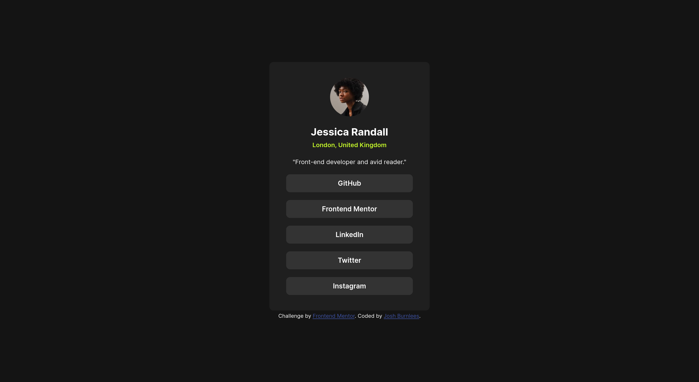

# Frontend Mentor - Social links profile solution

This is a solution to the [Social links profile challenge on Frontend Mentor](https://www.frontendmentor.io/challenges/social-links-profile-UG32l9m6dQ). Frontend Mentor challenges help you improve your coding skills by building realistic projects. 

## Table of contents

- [Overview](#overview)
  - [The challenge](#the-challenge)
  - [Screenshot](#screenshot)
  - [Links](#links)
- [My process](#my-process)
  - [Built with](#built-with)
  - [What I learned](#what-i-learned)
- [Author](#author)

## Overview

### The challenge

Users should be able to:

- See hover and focus states for all interactive elements on the page

### Screenshot



### Links

- Live Site URL: [https://burnlees.github.io/social-links-profile/](https://burnlees.github.io/social-links-profile/)

## My process

### Built with

- Semantic HTML5 markup
- CSS custom properties
- Flexbox

### What I learned

In this project I gained more experience with styling links, creating them into button-esque elements. Providing them with different stylings for different states.

```
ul.social-links li a:hover,
a:active {
  background-color: var(--clr-primary-grn);
  color: var(--clr-neutral-off-blk);
}
```

I tried to put into practise some of the feedback i recieved from the previous challenge, including using min-height rather than just height on the body element, and some slightly more semantic HTML.

I also used chrome's DevTools to my advantage with this challenge, was helpful being able to see the different elements and how they interact when live.

## Author

- Frontend Mentor - [@burnlees](https://www.frontendmentor.io/profile/burnlees)